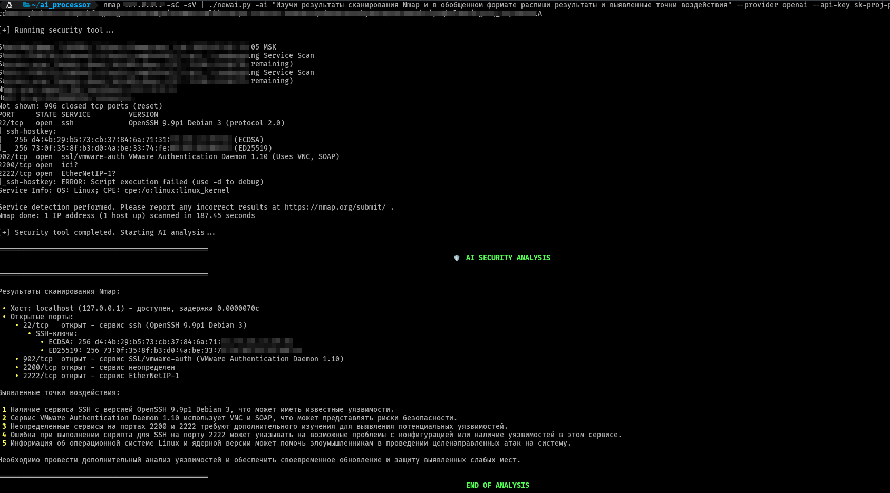
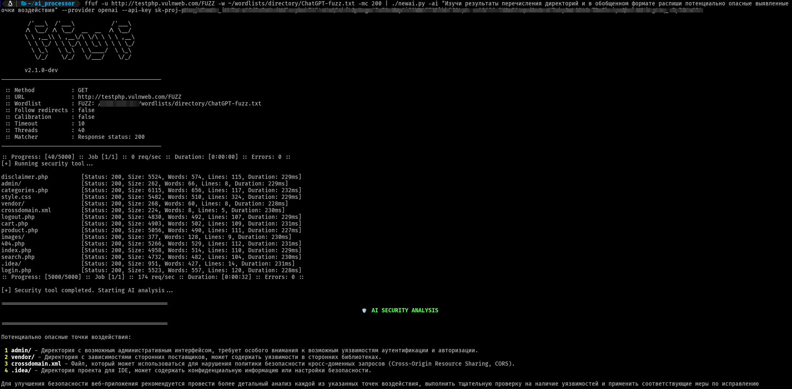

# AI Security Analysis Tool

This tool processes the output of security tools (like nmap, nikto, etc.) using AI to provide vulnerability analysis and insights. It supports multiple AI providers including OpenAI and Ollama.

## Key Features

- **Real-time Output**: Shows security tool results as they are generated
- **AI Analysis**: Provides professional vulnerability assessment after tool completion
- **Multiple Providers**: OpenAI, Ollama (local), DeepSeek
- **Visual Feedback**: Animated spinner during AI processing
- **Markdown Formatting**: Beautiful rendering of AI results





## Installation

```bash
pip install -r requirements.txt
```

## Usage

```bash
[security-tool-command] | ./ai_processor.py -ai "Your analysis prompt" [options]
```

### Basic Examples

**Live output of nmap results:**
```bash
nmap -sV -O target.com | ./ai_processor.py -ai "Analyze open ports and services" \
  --provider openai --api-key YOUR_API_KEY
```

**Process Nikto output without live display:**
```bash
nikto -host target.com | ./ai_processor.py -ai "List critical vulnerabilities" \
  --provider ollama --model llama2 --no-live
```

### Options
| Option         | Description                              | Default       |
|----------------|------------------------------------------|---------------|
| `-ai`, `--ai-prompt` | Analysis prompt (required)             | -             |
| `--provider`   | AI provider (`openai`, `ollama`, `deepseek`) | `openai`    |
| `--api-key`    | API key for providers                   | From ENV vars |
| `--model`      | Model name (e.g. `gpt-4`, `llama2`)    | Provider default |
| `--no-live`    | Disable live output of security tool    | Live output enabled |

## Workflow Demonstration

```plaintext
$ nmap -sV example.com | ./ai_processor.py -ai "Find vulnerabilities"

[+] Running security tool...

Starting Nmap 7.92 ( https://nmap.org ) at 2023-10-15 12:00 UTC
Nmap scan report for example.com (93.184.216.34)
Host is up (0.005s latency).
Not shown: 998 filtered tcp ports (no-response)
PORT    STATE SERVICE  VERSION
80/tcp  open  http     nginx
443/tcp open  ssl/http nginx

[+] Security tool completed. Starting AI analysis...

[+] AI processing ⣾  # Animated spinner appears here

==================================================
          🛡️ AI SECURITY ANALYSIS          
==================================================

### Service Analysis
- **HTTP (Port 80)**: 
  - 🚨 No redirect to HTTPS detected
  - ℹ️ Server: nginx (version not disclosed)
- **HTTPS (Port 443)**:
  - 🔒 TLS 1.2 supported
  - ⚠️ Missing security headers (HSTS, CSP)

### Vulnerability Assessment
1. **Missing HTTP to HTTPS Redirect** (Medium)
   - Allows plaintext communication
   - **Recommendation**: Implement 301 redirect

2. **Missing Security Headers** (Low-Medium)
   - Increases XSS and clickjacking risks
   - **Recommendation**: Add HSTS and CSP headers

==================================================
               END OF ANALYSIS               
==================================================
```

## Tips

1. For long-running tools, use `--no-live` to buffer output
2. Get better results with specific prompts:
   - "Prioritize critical vulnerabilities with remediation steps"
   - "Analyze SSL/TLS configuration weaknesses"
   - "Identify potential attack vectors"
3. Use specialized security models with Ollama:
   ```bash
   ollama pull security-llama
   ./ai_processor.py ... --provider ollama --model security-llama
   ```
